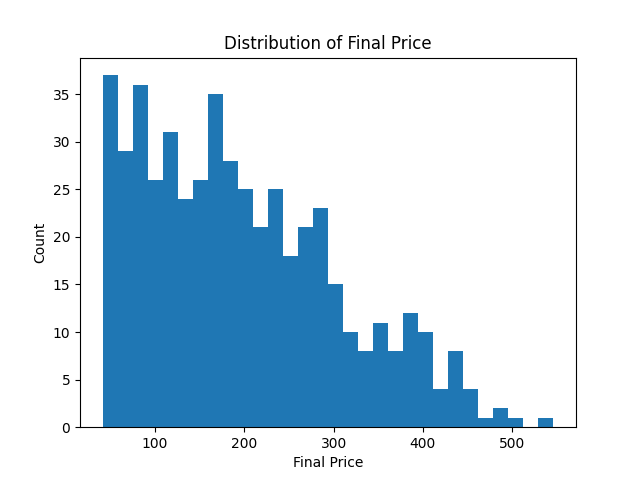
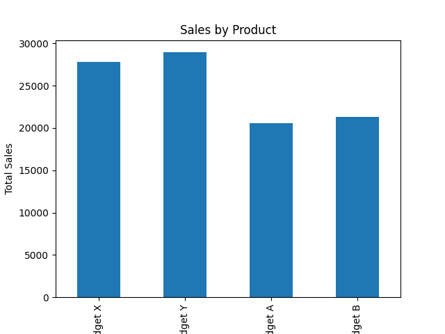
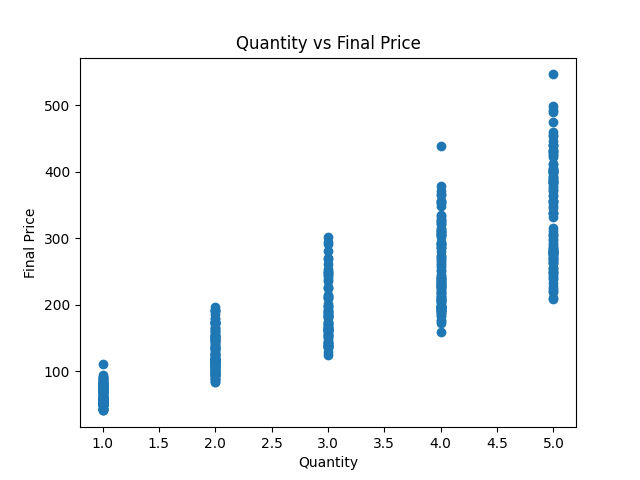

  

<h1 align="center">Sales Data Exploration Project</h1>

# Sales Data Exploration

Author: Shivamkumar Chandrakant Mantri
Course: B.Tech — Artificial Intelligence & Data Science
Topic: Data Analysis, EDA, Data Visualization, Python Automation
Tools: Python, Pandas, Matplotlib, Numpy, Git, VS Code

🧾 1. Project Overview

This project demonstrates a complete End-to-End Data Exploration (EDA) pipeline on a realistic Sales Dataset.
The goal is to simulate how data analysts and data scientists handle business datasets, extract insights, and prepare data for decision-making.

This project includes:

Generating a realistic sample sales dataset

Cleaning, preprocessing, and exploring data

Identifying trends, patterns, and relationships

Visualizing KPIs and metrics

Documenting observations in a structured report

Automating workflows through Python scripts

Uploading and version-controlling the project using GitHub

It serves as a strong foundation for Data Analytics, Business Intelligence, Machine Learning preprocessing, and real-world data engineering tasks.

🧱 2. Project Objectives
✔ Create a realistic synthetic sales dataset
✔ Perform full EDA using Python
✔ Understand business questions hidden in the data
✔ Visualize metrics such as:

Monthly sales trend

Product category performance

Quantity vs revenue relationship

Price distribution

✔ Handle missing values & data types
✔ Automate report generation
✔ Upload to GitHub as a clean professional project

---

# 📊 Output Visualizations

Below are the visual insights generated from the Exploratory Data Analysis (EDA) process.  
These charts help understand product performance, pricing behavior, sales trends, and customer purchasing patterns.

---

## 📈 1. Final Price Distribution
This histogram shows how final transaction values are distributed.  
It highlights the presence of low to mid-range transactions and some higher-value outliers.

---

## 🛍 2. Sales by Product Category
This bar chart compares total sales across different product categories such as Electronics, Clothing, Beauty, etc.

---

## 🔍 3. Quantity vs Final Price
This scatter plot helps identify whether buying more quantity increases revenue or if discounts influence purchase behavior.

---

## 📅 4. Monthly Sales Trend
This line chart shows how sales fluctuate month by month.  
It highlights seasonal patterns and peak sales months.

---

